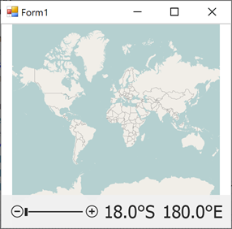

<!-- default badges list -->

<!-- default badges end -->

# Map for WinForms - Create a Data Provider to Load Image Tiles from a Custom Source

This example shows how to implement a custom image tile provider. To do this, create a [`MapDataProviderBase`](https://docs.devexpress.com/WindowsForms/DevExpress.XtraMap.MapDataProviderBase) class descendant and assign it to the [`ImageLayer.DataProvider`](https://docs.devexpress.com/WindowsForms/DevExpress.XtraMap.ImageLayer.DataProvider?p=netframework) property.

This example loads image tiles from a local cache. The image tiles are downloaded in advance from a public server with OpenStreetMap tiles. A list of alternative OpenStreetMap image tile providers is available here: [OpenStreetMap: Tile usage policy](https://operations.osmfoundation.org/policies/tiles/).

> **Note:** If you only need to change an URI to the location of OpenStreetMap image tiles, use the [`OpenStreetMapDataProvider`](https://docs.devexpress.com/WindowsForms/DevExpress.XtraMap.OpenStreetMapDataProvider) and specify its [`TileUriTemplate`](https://docs.devexpress.com/WindowsForms/DevExpress.XtraMap.OpenStreetMapDataProvider.TileUriTemplate) property.

## Files to Review

* [Form1.cs](./CS/CustomProvider/Form1.cs) (VB: [Form1.vb](./VB/CustomProvider/Form1.vb))

## Documentation

* [How to: Load Image Tiles from a Local Directory](https://docs.devexpress.com/WindowsForms/15460/controls-and-libraries/map-control/examples/map-image-data/how-to-load-image-tiles-from-a-local-directory)
* [Image Tile Providers](https://docs.devexpress.com/WindowsForms/115774/controls-and-libraries/map-control/map-image-data/image-tile-providers)
* [Geographical Projections](https://docs.devexpress.com/WindowsForms/15079/controls-and-libraries/map-control/coordinate-systems/geographical-projections?p=netframework)

## More Example

* [How to implement an in-memory image tile provider in the Map Control](https://github.com/DevExpress-Examples/how-to-use-in-memory-image-tile-provider)
